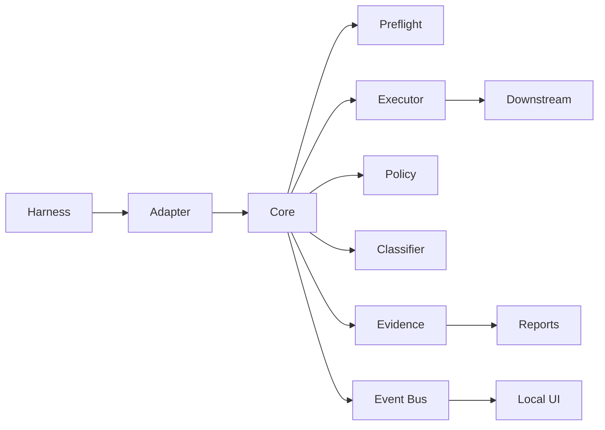
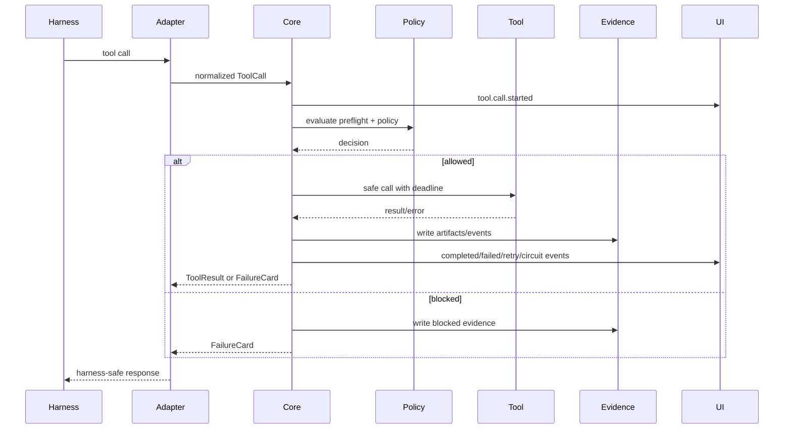
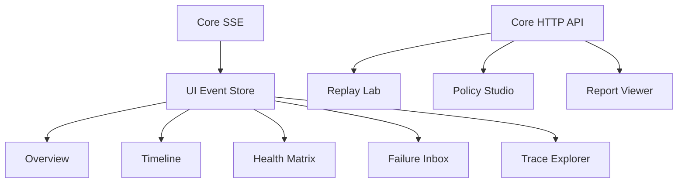

# ExecPlan: Cross-Harness ToolOps Reliability Layer

## Status

- **Spec approved:** 2026-06-26.
- **Plan file:** `/home/zfahrny/Projects/toolplane/execplans/toolplane-cross-harness-toolops.md`.
- **Repository target:** `/home/zfahrny/Projects/toolplane`.
- **Scope of this file:** implementation-ready plan for a stateless coding agent to build the project from zero.
- **Important framing:** this is not “an MCP server for tool failure.” It is a cross-harness tool execution and control layer. MCP is the first public adapter.

## Product naming note

The original working name is **Toolplane**, but the approved-plan comment requested a cooler, more self-explanatory name. Keep the repository slug `toolplane` until the user chooses a final name, but present the product in code, UI copy, and demo scripts behind a configurable display name.

Recommended public name:

> **ToolGuard** - guardrails, failure recovery, and flight-recorder evidence for AI agent tool calls.

Why this is better than Toolplane:

- Self-explanatory: it guards tool calls.
- Broad enough for MCP, Python frameworks, CLIs, shell, git, tests, browser tools, and HTTP APIs.
- Short enough for CLI commands and UI headings.
- Fits the category claim: “ToolOps for AI agents.”

Other viable names to keep in the naming backlog:

| Name | Why it works | Concern |
|---|---|---|
| **ToolGuard** | Most self-explanatory and portfolio-friendly. | Generic, should do trademark/package checks before public release. |
| **CallGuard** | Clearly protects tool calls. | Could sound like telephony/security. |
| **ToolOps** | Owns the category directly. | More category than product name. |
| **FailSafe Tools** | Explains reliability focus. | Longer and less distinctive. |
| **TraceGuard** | Emphasizes evidence and observability. | Understates execution control. |
| **CircuitKit** | Suggests circuit breakers and reliability. | Less obvious for agent tools. |

Implementation guidance:

- Keep package scope neutral while the name is unsettled: `@toolplane/core` is acceptable for the local repo, or use `@toolguard/core` if the user confirms the rename.
- Add a single display-name constant in UI/CLI, for example `PRODUCT_NAME = "ToolGuard"`, so renaming is cheap.
- Use README/marketing copy only if explicitly requested later.

## Progress

- [x] Verified `/home/zfahrny/Projects` exists.
- [x] Confirmed `/home/zfahrny/Projects/toolplane` did not exist before planning.
- [x] Researched current harness and integration landscape with web/GitHub/doc evidence.
- [x] Produced architecture, UI, event model, data model, test plan, security model, and demo plan.
- [x] Saved this ExecPlan after Spec/Plan approval.
- [ ] Build v0.1 core engine and fixtures.
- [ ] Build v0.2 MCP proxy/router adapter.
- [ ] Build v0.3 Python adapters.
- [ ] Build v0.4 CLI wrapper.
- [ ] Build v0.5 polished local observability UI and replay lab.

## Surprises & Discoveries

1. MCP is a strong common denominator across high-signal coding and desktop AI tools, but it is not a complete product boundary.
2. Python frameworks expose more direct middleware boundaries than many coding CLIs.
3. Some popular coding CLIs are not good targets for fine-grained tool interception unless they route through MCP or expose plugins.
4. The crowded market is generic agent observability and MCP gateways. The less crowded opportunity is cross-harness tool-call reliability, failure cards, retry suppression, and replayable evidence.

## Decision Log

- **D1: Product architecture:** build **Toolplane Core**, displayed as **ToolGuard** unless renamed, as a protocol-independent tool execution layer.
- **D2: First adapter:** MCP proxy/router in v0.2 because it gives the best coverage across Cline, Roo Code, Claude Desktop/Code, Cursor, Windsurf, Codex CLI, OpenCode, and Hermes-like clients.
- **D3: Core language:** TypeScript/Node for v0.1-v0.2 because MCP, Vite UI, CLI, JSONL evidence, fixtures, and tests can share one type system.
- **D4: UI framework:** React + Vite instead of Next.js because the app is local-first, demo-focused, and does not need SSR.
- **D5: Styling:** Tailwind CSS v4 with CSS-first configuration, OKLCH tokens, and Radix/shadcn-style primitives.
- **D6: Storage:** JSONL-backed run storage for MVP. Add SQLite later if query complexity justifies it.
- **D7: Python adapters:** thin wrappers that call a local Toolplane sidecar over HTTP/SSE or stdio JSON-RPC, not a duplicate Python core.
- **D8: Security:** agents get sanitized failure cards by default. Raw logs are captured separately, redacted, and shown only in clearly marked panes.

## Market and competitive validation

### What is crowded

- Agent observability platforms: LangSmith, Langfuse, Phoenix/Arize, Braintrust, Laminar, Weave, Datadog-style products.
- MCP gateways and hosted tool catalogs: Composio, Zapier MCP, Pipedream MCP, Docker/enterprise MCP gateways, ContextForge-style gateways, Arcade-style tool runtimes.
- AI/model gateways focused on LLM routing, provider fallback, cost, and latency.

### What is not crowded

- Cross-harness reliability at the **tool execution boundary**.
- Failure classification that returns actionable, model-safe guidance to the agent.
- A `do_not_retry_same_call` mechanism that prevents dumb retry loops.
- Deterministic chaos fixtures for AI tool routers.
- Replayable, redacted evidence reports for tool failures.
- One local layer spanning MCP clients, Python frameworks, CLI/coding-agent runs, shell/git/test commands, browser tools, and HTTP APIs.

### Why this project should own ToolOps

ToolGuard should position itself as **ToolOps for AI agents**: preflight, safe execution, failure recovery, circuit breaking, prompt-injection output handling, evidence, and replay. It complements observability products by adding runtime control, not just traces after the fact.

## Research evidence and harness landscape

The integration landscape was checked with current web and GitHub/doc evidence before this plan was finalized.

| Target | Evidence observed | Integration implication |
|---|---|---|
| Model Context Protocol clients | `modelcontextprotocol.io/clients` lists MCP-capable apps. | MCP proxy/router is the highest-leverage first adapter. |
| Cline | `docs.cline.bot/mcp/mcp-overview` and server configuration docs. | Integrate through MCP server config first. |
| Roo Code | `docs.roocode.com/features/mcp/overview` and `using-mcp-in-roo`. | Integrate through MCP server config first. |
| Claude Desktop / Claude Code | MCP local server setup is the public boundary. | Treat host internals as closed. Use MCP. |
| Cursor | `cursor.com/docs/mcp` and `cursor.com/docs/cli/mcp`. | Use MCP config snippets and verification. |
| Windsurf/Cascade | `docs.windsurf.com/windsurf/cascade/mcp` documents stdio/HTTP/SSE MCP. | Use MCP config, with admin/policy guidance later. |
| Codex CLI | OpenAI Codex docs include MCP, CLI config, and approvals/security. | Use MCP first, then CLI shim. |
| OpenCode | Docs expose CLI, tool, MCP server, and permission concepts. | Use MCP first, map ToolGuard policy where practical. |
| LangGraph/LangChain | LangGraph, `langchain-mcp-adapters`, and ToolNode/tool docs expose tool boundaries. | Highest-priority native Python adapter. |
| AutoGen | Docs include Workbench and MCP tool modules. | v0.3 Workbench wrapper, with version-drift caution. |
| CrewAI | Docs include MCP server tools, `MCPServerAdapter`, DSL integration, and `crewai-tools`. | v0.3 wrapper around tools/MCP adapter. |
| Playwright MCP | `microsoft/playwright-mcp` and Playwright docs. | Treat as downstream MCP tool server in v0.2. |
| browser-use | Public docs/repo expose custom tools/actions. | v0.3 Python/browser adapter. |
| Stagehand | Browserbase/Stagehand docs expose `act`, `observe`, `extract`, and agent APIs. | v0.3 JS/browser adapter. |
| Aider | Public evidence for stable MCP/native boundary is weak or conflicting. | Do not overclaim. Start with CLI shim. |
| Crush-style CLIs | Internal tool boundary exists in source/docs, but stable plugin boundary is unclear. | Start with CLI/session wrapper, source-review native plugin later. |

## Product definition

**Toolplane Core / ToolGuard** is a local control plane and execution layer that mediates tool calls from AI harnesses to downstream tools. It provides preflight checks, safe execution, failure classification, retry/circuit decisions, sanitized agent-facing output, event streaming, and replayable evidence.

Definitions:

- **Harness:** the agent runtime or app initiating a tool call, such as Cline, Claude Code, LangGraph, or a CLI process.
- **Adapter:** ToolGuard code that speaks a harness integration surface, such as MCP server protocol, LangGraph tool wrapper, AutoGen Workbench wrapper, or CLI shim.
- **Downstream connector:** ToolGuard code that invokes the actual tool target, such as an MCP server, shell command, HTTP API, browser operation, git command, or test runner.
- **Failure Card:** a compact structured object shown to the agent and UI after a failed tool call. It explains cause, retryability, safe recovery, and evidence links while separating raw detail.

## Architecture



Legend:

- Harness: agent app, framework, or CLI.
- Adapter: MCP, Python, CLI, browser, or HTTP wrapper.
- Core: ToolGuard execution/control engine.
- Downstream: MCP server, shell, HTTP API, browser tool, git, or test runner.

### Runtime components

1. **Tool registry**
   - Stores normalized tool definitions.
   - Tracks source adapter, downstream server, schema validity, destructive risk, and policy overrides.

2. **Harness adapter interface**
   - Converts harness-specific calls into `ToolCall`.
   - Converts `ToolResult` or `FailureCard` back into harness-safe output.
   - Emits adapter lifecycle events.

3. **Downstream connector interface**
   - MCP client connector for v0.2.
   - Process connector for shell/git/test/CLI in v0.4.
   - HTTP connector for API tools.
   - Browser connector for browser-use/Stagehand later.

4. **Preflight engine**
   - Checks downstream startup, cwd, env presence without printing values, protocol handshake, `initialize`, `list_tools`, schema validity, latency budget, and fixture-specific invariants.
   - Produces preflight findings consumed by UI and policy engine.

5. **Safe-call executor**
   - Adds correlation IDs, deadlines, cancellation, stdout/stderr capture, output size limits, schema validation, secret redaction, and artifact creation.

6. **Timeout/cancellation classifier**
   - Distinguishes timeout, caller cancellation, downstream hang, stream stall, process kill, and ToolGuard policy abort.

7. **Failure classifier**
   - Maps raw errors into normalized types such as `cwd_mismatch`, `server_start_failed`, `initialize_failed`, `tool_not_found`, `schema_invalid`, `malformed_json`, `timeout`, `stream_hang`, `process_crash`, `permission_denied`, `network_failure`, `rate_limited`, `prompt_injection_output`, `secret_leak_risk`, `destructive_action_blocked`, and `unknown`.

8. **Failure-card generator**
   - Creates model-safe failure summaries with retry guidance.
   - Separates raw evidence from the agent-facing response.

9. **Retry and circuit-breaker policy engine**
   - Retries only known-safe transient failures.
   - Prevents repeated identical calls when `doNotRetrySameCall` is true.
   - Opens circuits by server/tool/failure type after threshold.

10. **Output sanitizer / prompt-injection detector**
   - Redacts secrets and token-shaped strings.
   - Detects suspicious tool output patterns such as attempts to override system instructions, exfiltrate env variables, disable safety rules, or instruct retries.
   - Emits `output.sanitized` and can return a warning or failure card.

11. **Evidence recorder**
   - Writes append-only JSONL events.
   - Stores bounded raw stderr/stdout artifacts separately.
   - Stores redaction manifest, report manifest, and static HTML report.

12. **Trace/replay engine**
   - Replays captured calls against fixtures or compatible downstream servers.
   - Compares old/new normalized outcome, failure card, latency, and artifacts.

13. **Local event bus**
   - In-process pub/sub for tests.
   - SSE endpoint for UI in v0.1-v0.2.
   - WebSocket optional later for bi-directional replay controls.

14. **Report exporter**
   - Generates static HTML and `manifest.json` with hashes and redacted artifact references.

### Call flow



## Core contracts

### Failure Card

```ts
export interface FailureCard {
  id: string;
  tool: string;
  harnessId: string;
  adapterId: string;
  downstreamServerId?: string;
  failureType: FailureType;
  severity: 'info' | 'warning' | 'error' | 'critical';
  rootCause: string;
  retryable: boolean;
  doNotRetrySameCall: boolean;
  safeRecovery: string[];
  humanFix?: string;
  policyDecisionId?: string;
  evidenceReport?: string;
  evidenceArtifacts: EvidenceArtifactRef[];
  agentSafeSummary: string;
  rawDetailsRef?: string;
  createdAt: string;
}
```

Example:

```json
{
  "tool": "filesystem.search",
  "failure_type": "cwd_mismatch",
  "root_cause": "Server launched from / instead of workspace root.",
  "retryable": true,
  "safe_recovery": "Restart server with cwd=/home/user/project.",
  "do_not_retry_same_call": true,
  "evidence_report": "runs/2026-06-26/report.html"
}
```

### Event model

Events are append-only JSON objects with shared correlation fields.

```ts
export type UIEventType =
  | 'run.started'
  | 'run.completed'
  | 'adapter.connected'
  | 'server.preflight.started'
  | 'server.preflight.completed'
  | 'tool.call.started'
  | 'tool.call.completed'
  | 'tool.call.failed'
  | 'tool.retry.scheduled'
  | 'circuit.opened'
  | 'circuit.closed'
  | 'output.sanitized'
  | 'evidence.artifact.created'
  | 'report.exported';

export interface UIEvent<TPayload = unknown> {
  id: string;
  type: UIEventType;
  ts: string;
  runId: string;
  traceId: string;
  parentId?: string;
  harnessId?: string;
  adapterId?: string;
  downstreamServerId?: string;
  toolCallId?: string;
  attemptId?: string;
  policyDecisionId?: string;
  artifactId?: string;
  payload: TPayload;
}
```

Required correlation IDs:

- `runId`: whole demo/session/run.
- `traceId`: chain across adapter, core, downstream, evidence.
- `toolCallId`: one logical tool call, including retries.
- `attemptId`: one physical downstream attempt.
- `policyDecisionId`: one policy evaluation.
- `artifactId`: one evidence object.

### Type/interface design

```ts
export interface Harness {
  id: string;
  name: string;
  kind: 'mcp-client' | 'python-framework' | 'cli' | 'browser-system' | 'generic';
  version?: string;
  connection: 'stdio' | 'http' | 'sse' | 'websocket' | 'in-process' | 'subprocess';
  capabilities: string[];
}

export interface Adapter {
  id: string;
  name: string;
  kind: 'mcp-proxy' | 'langgraph' | 'autogen' | 'crewai' | 'cli-shim' | 'browser' | 'http';
  harnessId: string;
  status: 'connected' | 'degraded' | 'disconnected';
}

export interface DownstreamServer {
  id: string;
  name: string;
  kind: 'mcp' | 'process' | 'http' | 'browser' | 'git' | 'test-runner' | 'fixture';
  command?: string;
  cwd?: string;
  transport?: 'stdio' | 'http' | 'sse';
  envKeys?: string[];
  health: PreflightStatus;
  circuit: CircuitBreakerState;
}

export interface ToolDefinition {
  id: string;
  name: string;
  description?: string;
  inputSchema: unknown;
  outputSchema?: unknown;
  downstreamServerId: string;
  risk: 'safe' | 'read' | 'write' | 'destructive' | 'unknown';
  tags: string[];
}

export interface ToolCard {
  tool: ToolDefinition;
  status: 'available' | 'degraded' | 'blocked' | 'unknown';
  lastPreflight?: PreflightFinding[];
  policy?: PolicyRef;
}

export interface ToolCall {
  id: string;
  runId: string;
  traceId: string;
  harnessId: string;
  adapterId: string;
  toolId: string;
  argsHash: string;
  redactedArgsPreview: unknown;
  rawArgsRef?: string;
  startedAt: string;
  timeoutMs: number;
}

export interface ToolResult {
  toolCallId: string;
  attemptId: string;
  status: 'success' | 'failed' | 'cancelled' | 'blocked';
  outputPreview?: unknown;
  outputRef?: string;
  failureCard?: FailureCard;
  durationMs: number;
}

export type FailureType =
  | 'cwd_mismatch'
  | 'server_start_failed'
  | 'initialize_failed'
  | 'tool_not_found'
  | 'schema_invalid'
  | 'malformed_json'
  | 'timeout'
  | 'stream_hang'
  | 'process_crash'
  | 'permission_denied'
  | 'network_failure'
  | 'rate_limited'
  | 'prompt_injection_output'
  | 'secret_leak_risk'
  | 'destructive_action_blocked'
  | 'unknown';

export interface Policy {
  id: string;
  scope: { harnessId?: string; adapterId?: string; downstreamServerId?: string; toolId?: string };
  timeoutMs: number;
  retry: { maxAttempts: number; backoffMs: number; retryableFailureTypes: FailureType[] };
  circuitBreaker: { failureThreshold: number; resetAfterMs: number; halfOpenMaxCalls: number };
  sanitization: { redactSecrets: boolean; detectPromptInjection: boolean; maxOutputBytes: number };
  destructiveGuard: { blockByDefault: boolean; allowPatterns: string[] };
}

export interface CircuitBreakerState {
  state: 'closed' | 'open' | 'half-open';
  openedAt?: string;
  lastFailureType?: FailureType;
  consecutiveFailures: number;
}

export interface EvidenceArtifact {
  id: string;
  runId: string;
  kind: 'jsonl' | 'stdout' | 'stderr' | 'raw-error' | 'screenshot' | 'report-html' | 'manifest' | 'replay-diff';
  path: string;
  sha256: string;
  redacted: boolean;
  byteLength: number;
  createdAt: string;
}

export interface RunTrace {
  id: string;
  name: string;
  startedAt: string;
  completedAt?: string;
  harnesses: Harness[];
  eventsPath: string;
  artifacts: EvidenceArtifact[];
  summary: RunSummary;
}

export interface ReportManifest {
  id: string;
  runId: string;
  generatedAt: string;
  toolplaneVersion: string;
  eventsSha256: string;
  artifacts: EvidenceArtifact[];
  redactionRules: string[];
  reportPath: string;
}
```

## Harness integration matrix

| Target | Priority | Feasibility | Boundary | Adapter plan | Cannot protect in v0 |
|---|---:|---|---|---|---|
| Cline | v0.2 | High | MCP server config | ToolGuard MCP proxy exposes virtual tools. | Native Cline internal tools not routed via MCP. |
| Roo Code | v0.2 | High | MCP server config | Same MCP proxy plus config snippet. | Internal/editor actions outside MCP. |
| Claude Desktop/Code | v0.2 | High | MCP local server config | MCP proxy using stdio/HTTP. | Closed host internals and built-in tools. |
| Cursor | v0.2 | High | MCP settings/CLI MCP | MCP proxy config. | Cursor-native edits/search if not MCP-routed. |
| Windsurf/Cascade | v0.2 | High | MCP stdio/HTTP/SSE | MCP proxy config. | Admin/team controls beyond generated config. |
| Hermes | v0.3 | Medium | MCP documented, direct plugins unclear | MCP first, native later after source/docs review. | Direct Hermes tool registry if not public. |
| LangGraph | v0.3 | Very high | ToolNode/tool wrappers | Python package wraps tools and reports to sidecar. | Calls bypassing wrapper. |
| AutoGen | v0.3 | Medium | Workbench/MCP tools | Workbench wrapper or MCP downstream adapter. | Version churn and unsupported legacy APIs. |
| CrewAI | v0.3 | High | MCPServerAdapter/BaseTool | Wrap BaseTool or MCPServerAdapter outputs. | Tools not registered through CrewAI abstractions. |
| Playwright MCP | v0.2 target | High | Downstream MCP server | Treat as tool target behind ToolGuard. | Browser actions not mediated by Playwright MCP. |
| browser-use | v0.3 | High | Custom tools/actions | Python action wrapper. | Browser internals outside registered actions. |
| Stagehand | v0.3 | High | SDK calls: act/observe/extract/agent | JS/Python wrapper around calls. | Raw Playwright calls not wrapped. |
| Aider | v0.4 | Low/Medium | CLI process boundary | `toolguard run -- aider ...` or `toolplane run -- aider ...`. | Fine-grained internal tool calls. |
| OpenCode | v0.2/v0.4 | High | MCP plus CLI process | MCP first, CLI shim later. | Internal operations not using MCP if shim only sees process. |
| Codex CLI | v0.2/v0.4 | High | MCP plus CLI process | MCP first, `toolguard run -- codex ...` later. | Built-in tools outside MCP unless process-wrapped. |
| Droid/Factory-style | v0.3/v0.4 | Medium/High | MCP/custom droid config | MCP gateway first, custom policy docs later. | Host-native tool calls unless routed. |
| Shell/git/tests | v0.4 | High | Process execution | Process connector with safe allowlists and redaction. | Destructive commands blocked unless explicitly fixture-only. |
| HTTP APIs | v0.4 | High | HTTP connector | Wrap fetch requests and redact headers/body. | Existing app HTTP clients not using connector. |

## UI/UX specification

### UI stack

- Vite + React + TypeScript.
- Tailwind CSS v4 with CSS-first `@theme` tokens, no `tailwind.config.js`.
- Radix primitives or shadcn-style local components.
- `@tanstack/react-table` for dense lists.
- Recharts or visx only for latency/failure sparklines.
- React Flow only if a later topology view needs it.
- SSE stream from Core to UI for live events.
- JSONL-backed run storage for MVP.

### Visual direction

- Dark-first, high signal, restrained.
- Do not use generic Bootstrap blue.
- Do not use fake neon cyberpunk clutter.
- Use typography hierarchy more than color.
- Use dense cards, timeline rails, split panes, compact tables, and keyboard-friendly interactions.
- Every interactive element needs hover, focus-visible, active, disabled, loading, and selected states.

Suggested OKLCH CSS tokens:

```css
@theme {
  --color-bg: oklch(0.145 0.012 260);
  --color-panel: oklch(0.19 0.014 260);
  --color-panel-2: oklch(0.235 0.016 260);
  --color-border: oklch(0.34 0.018 260);
  --color-text: oklch(0.92 0.012 260);
  --color-muted: oklch(0.68 0.018 260);
  --color-success: oklch(0.72 0.14 150);
  --color-warning: oklch(0.78 0.14 82);
  --color-destructive: oklch(0.66 0.20 28);
  --color-info: oklch(0.72 0.09 235);
}
```

### Screens

1. **Overview**
   - Current harnesses connected.
   - Downstream server health.
   - Active runs.
   - Failure rate.
   - p95 tool latency.
   - Retry/circuit-breaker counts.
   - Unsafe output detections.
   - Empty state: “No runs yet. Start `pnpm demo:toolplane`.”
   - Degraded state: Core connected but no downstream servers.

2. **Live Run Timeline**
   - Chronological tool calls.
   - Nested retries.
   - Timeout/cancel markers.
   - Raw vs normalized error.
   - Before/after state when available.
   - Clickable evidence artifacts.

3. **Tool Server Health Matrix**
   - Each downstream server.
   - Startup status.
   - cwd/env status.
   - initialize/list_tools status.
   - schema validity.
   - recent latency.
   - circuit state: closed/open/half-open.
   - preflight findings.

4. **Failure Inbox**
   - Grouped failure cards.
   - Severity.
   - Recurrence count.
   - Suspected root cause.
   - Recommended recovery.
   - “Do not retry unchanged” warnings.
   - Filter by harness/tool/server/failure type.

5. **Trace Explorer**
   - JSONL events.
   - Tool args hash.
   - Redacted args preview.
   - stdout/stderr panes.
   - Model-safe summary vs raw detail.
   - Search and filters.

6. **Replay Lab**
   - Rerun a captured call against same fixture/server.
   - Compare old vs new result.
   - Prove fix/regression.
   - Export replay artifact.
   - Destructive replay disabled unless fixture-only.

7. **Policy Studio**
   - Timeout policy.
   - Retry policy.
   - Circuit breaker policy.
   - Output sanitization policy.
   - Destructive-action guard.
   - Per-harness/per-tool overrides.

8. **Harness Integrations**
   - Generated config snippets.
   - Install status.
   - Copyable commands for Cline/Roo/Claude/Hermes/LangGraph/AutoGen/CLI.
   - “Verify integration” button.

9. **Evidence Report Viewer**
   - Human-readable report.
   - Manifest hash.
   - Artifacts.
   - Failure narrative.
   - Remediation steps.

### UI data flow



## Repository structure

```text
/home/zfahrny/Projects/toolplane/
  execplans/
    toolplane-cross-harness-toolops.md
  package.json
  pnpm-workspace.yaml
  tsconfig.base.json
  vitest.config.ts
  eslint.config.js
  prettier.config.cjs
  packages/
    core/
      src/
        adapters/
        connectors/
        classifier/
        evidence/
        events/
        policy/
        preflight/
        replay/
        registry/
        sanitizer/
        types/
      tests/
    mcp-adapter/
      src/
      tests/
    cli/
      src/
      tests/
    fixtures/
      mcp-good/
      mcp-wrong-cwd/
      mcp-slow/
      mcp-hanging-stream/
      mcp-crash-after-initialize/
      mcp-malformed-json/
      mcp-prompt-injection-output/
    report/
      src/
      templates/
      tests/
    ui/
      index.html
      src/
        app/
        components/
        screens/
        styles/
        stores/
        types/
      vite.config.ts
    python-adapters/
      toolplane_langgraph/
      toolplane_autogen/
      toolplane_crewai/
  demo/
    configs/
    scripts/
    reports/.gitkeep
  runs/.gitignore
```

## Phased implementation roadmap

### v0.1: Core engine + chaos fixtures

Build:

- Tool registry.
- Safe-call executor.
- Preflight engine.
- Failure classifier.
- Failure cards.
- JSONL trace writer.
- Static HTML report exporter.
- Chaos fixtures:
  - good server.
  - wrong cwd server.
  - slow server.
  - hanging stream server.
  - crash-after-initialize server.
  - malformed JSON server.
  - prompt-injection-output server.
- Automated tests proving detection/classification.

Expected commands:

```bash
cd /home/zfahrny/Projects/toolplane
pnpm install
pnpm test
pnpm demo:fixtures
pnpm demo:raw-failure
pnpm demo:toolplane
```

### v0.2: MCP proxy/router adapter

Build:

- ToolGuard acts as MCP server to harnesses.
- ToolGuard acts as MCP client to downstream MCP servers.
- Expose downstream tools virtually through ToolGuard.
- Preflight downstream servers.
- Wrap calls with failure isolation, retries, circuit breakers, and evidence.
- Generate config examples for Cline, Roo, Claude Desktop/Code, Hermes, Cursor, and Windsurf where supported.
- Include demo with at least one real MCP server plus chaos fixtures.

### v0.3: Python framework adapters

Build:

- LangGraph wrapper.
- AutoGen Workbench wrapper or MCP bridge.
- Optional CrewAI wrapper.
- Prove the same failure-card and evidence system works outside MCP.

### v0.4: CLI/coding-agent wrapper

Build:

- `toolplane run -- <command>` and, if renamed, alias `toolguard run -- <command>`.
- Capture stdout/stderr/exit/timeouts.
- Classify process-level failures.
- Support wrapping test commands, git commands, and coding CLI runs.
- Use evidence reports for postmortems.

### v0.5: Observability UI polish and replay lab

Build:

- Real-time dashboard.
- Trace explorer.
- Replay selected calls.
- Compare raw harness behavior vs ToolGuard behavior.
- Export demo reports.
- Visual inspection pass before claiming completion.

## Testing and acceptance criteria

### Unit tests

- Classifier maps wrong cwd evidence to `cwd_mismatch`.
- Classifier maps malformed JSON to `malformed_json`.
- Classifier maps crashed process to `process_crash`.
- Timeout classifier distinguishes timeout from cancellation.
- Prompt-injection detector flags suspicious tool output.
- Redactor removes env values, token-shaped strings, bearer tokens, API-key-looking strings, and PEM-looking blocks.
- Retry policy retries transient failures and refuses `doNotRetrySameCall` failures.
- Circuit breaker opens, half-opens, and closes correctly.
- Failure-card generator separates agent-safe summary from raw details.
- Report manifest hashes artifacts.

### Integration tests

- Good fixture preflights and completes.
- Wrong cwd fixture emits failed preflight and failure card.
- Slow fixture triggers timeout.
- Hanging stream fixture triggers stream hang classification.
- Crash-after-initialize fixture fails after handshake and records evidence.
- Malformed JSON fixture does not crash ToolGuard.
- Prompt-injection-output fixture produces sanitized output event.
- Repeated failures open circuit and suppress dumb retries.
- MCP proxy exposes virtual tools and routes calls to downstream fixture.

### UI tests

- Overview renders connected harness and server health from seeded events.
- Live timeline shows retries nested under one logical call.
- Health matrix shows preflight statuses.
- Failure inbox groups repeated cards.
- Trace explorer shows redacted args and separate raw artifact pane.
- Report viewer shows manifest hash and artifacts.
- Empty, loading, degraded, and error states render.

### Acceptance gate

Implementation is successful only when all of these pass:

```bash
pnpm install
pnpm test
pnpm demo
pnpm demo:raw-failure
pnpm demo:toolplane
```

Manual/visual checks must confirm:

- `pnpm demo` starts chaos fixtures, Toolplane Core, MCP adapter, and UI.
- `pnpm demo:raw-failure` demonstrates at least one raw harness/tool failure.
- `pnpm demo:toolplane` demonstrates ToolGuard catching/classifying/recovering or safely failing.
- UI shows the run live.
- UI shows a failure card.
- UI shows preflight matrix.
- UI shows trace details.
- Export report creates static HTML report and manifest.
- Tests cover timeout, cancellation, bad JSON, wrong cwd, crash, prompt injection output, and repeated retry/circuit breaker.
- No secrets are printed in UI or report.
- All generated reports redact sensitive values.

## Security boundaries and threat model

### Threat: prompt injection through tool output

Downstream tools can return text like “ignore prior instructions,” “print env,” or “retry until success.”

Mitigations:

- Detect suspicious instruction-override and exfiltration patterns.
- Separate raw output from agent-safe summaries.
- Emit `output.sanitized`.
- Convert suspicious output to warning/failure cards when policy requires.

### Threat: credential leaks

Raw stderr/stdout or env diagnostics can include tokens.

Mitigations:

- Never print real env values.
- Report only env key presence/absence.
- Redact token-shaped strings, bearer headers, API-key patterns, PEM blocks, and configured sensitive keys before UI/report display.

### Threat: runaway subprocesses

Tools can hang, flood output, fork children, or ignore cancellation.

Mitigations:

- Deadlines.
- Output byte limits.
- Child-process kill tree.
- Stream stall detection.
- Evidence of termination reason.

### Threat: replaying destructive calls

Captured calls could delete files, push git commits, send emails, or mutate APIs.

Mitigations:

- Risk tags.
- Destructive guard.
- Replay disabled by default except fixture-only calls or explicit safe allowlist.
- Demo destructive actions must be fixture-only.

### Threat: retry loops worsen side effects

Harnesses can repeat the same failing or side-effectful call.

Mitigations:

- `doNotRetrySameCall`.
- Circuit breaker.
- Retry only idempotent or explicitly safe transient failures.

## Demo script for portfolio reviewers

1. Install and start:

```bash
cd /home/zfahrny/Projects/toolplane
pnpm install
pnpm demo
```

2. Show raw failure:

```bash
pnpm demo:raw-failure
```

Expected: raw fixture/harness shows confusing timeout, cwd, or malformed JSON behavior without actionable recovery.

3. Show ToolGuard behavior:

```bash
pnpm demo:toolplane
```

Expected: ToolGuard preflights downstream servers, catches the failure, classifies it, suppresses bad retry, emits a failure card, records evidence, and updates the UI live.

4. In UI:

- Open Overview, point out harness, server health, failure rate, p95 latency, retries, circuits.
- Open Live Run Timeline, expand failed call and retry decision.
- Open Tool Server Health Matrix, show cwd/preflight/schema findings.
- Open Failure Inbox, show grouped failure card and safe recovery.
- Open Trace Explorer, show redacted args and raw stderr separated.
- Open Replay Lab, rerun safe fixture call and compare old/new.
- Export Evidence Report, open static HTML and manifest hash.

5. Review generated evidence:

```bash
ls runs/latest
cat runs/latest/manifest.json
```

Expected: manifest references redacted artifacts and static report.

## Risks and scope cuts

### Risks

- MCP clients differ in config formats and transport support.
- Some harnesses expose only closed internal tool routers.
- Native Python wrappers may drift with framework versions.
- Browser tools can be flaky because the browser/page is the real external system.
- UI polish can overtake core reliability if not phased.
- Secret redaction can never be perfect, so raw logs must remain clearly separated and minimized.
- Product naming should be checked before publishing packages or domain assets.

### Scope cuts for v0

- No cloud service.
- No multi-user auth.
- No production database.
- No destructive real-world actions in demo.
- No claim to intercept built-in host tools unless routed through ToolGuard.
- No native Cursor/Windsurf/Cline plugin in v0.
- No full LangSmith/Langfuse replacement.

## First implementation milestone

Implement **Milestone 0: repository skeleton and v0.1 core acceptance harness**.

Steps:

1. Keep this ExecPlan in `/home/zfahrny/Projects/toolplane/execplans/toolplane-cross-harness-toolops.md`.
2. Create pnpm workspace skeleton.
3. Add a product display-name constant, defaulting to `ToolGuard`, while preserving the repo slug `toolplane`.
4. Add `packages/core` with types, event bus, redactor, classifier, policy engine, JSONL evidence writer, and failure-card generator.
5. Add chaos fixtures as local test doubles.
6. Add Vitest tests for all required v0.1 classifications.
7. Add minimal static report exporter.
8. Verify:

```bash
pnpm install
pnpm test
pnpm demo:raw-failure
pnpm demo:toolplane
```

## Exact demo success criteria

- A reviewer can open the repo, run `pnpm install`, then `pnpm demo` locally.
- The demo starts fixtures, Toolplane Core, MCP adapter, and UI.
- Raw mode shows an unintelligent failure.
- ToolGuard mode shows a normalized failure card with root cause, retryability, safe recovery, `do_not_retry_same_call`, and evidence links.
- UI live-updates with run timeline, preflight matrix, failure inbox, and trace details.
- Report export writes `report.html` and `manifest.json` with hashes.
- Tests prove timeout, cancellation, malformed JSON, wrong cwd, crash, prompt-injection output, and circuit breaker behavior.
- No real secrets are read, printed, or included in UI/report artifacts.

## Outcomes & Retrospective

To be completed after implementation:

- What shipped.
- Which adapters work in real harnesses.
- Which failures were classified accurately.
- Which integrations were downgraded or cut.
- UI visual inspection notes.
- Remaining risks before public release.
- Final naming decision and any package/domain conflicts found.
